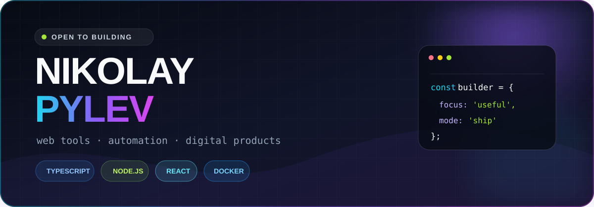
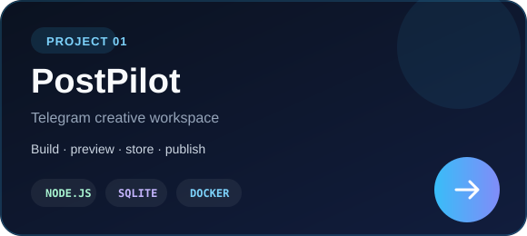
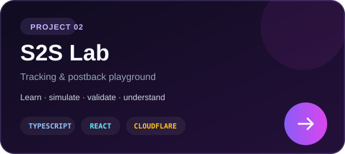

 

<h2>Hi, I'm Nikolay 👋</h2>

  I build practical web tools and automation for real-world workflows. 
  TypeScript / Node.js / React — with a soft spot for APIs, tracking systems and clean product UX.

 

## ⚡ Tech I use

 

## 🚀 Featured builds

<table>
  <tr>
    <td width="50%" valign="top">
      
      

        <a href="https://postpilot.s2slab.ru/"><b>Live demo ↗</b></a>
        &nbsp;·&nbsp;
        <a href="https://github.com/Sarkozy0707/postpilot">Source code</a>
      

    </td>
    <td width="50%" valign="top">
      
      

        <a href="https://s2slab.ru/"><b>Live demo ↗</b></a>
        &nbsp;·&nbsp;
        <a href="https://github.com/Sarkozy0707/s2s-lab">Source code</a>
      

    </td>
  </tr>
</table>

 

## 📊 GitHub snapshot

  
  

 

`build → test → ship → improve`

Useful products over decorative code.

