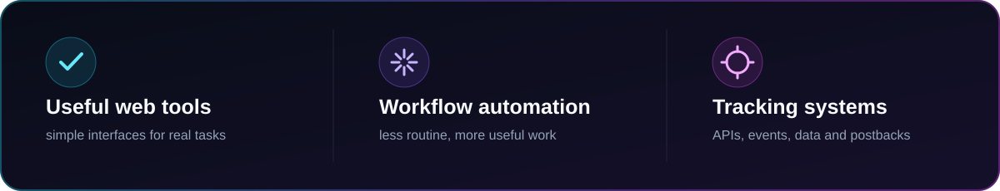

## ◈ About me

- Building practical web tools and internal products
- Working with **TypeScript, Node.js and React**
- Interested in APIs, S2S tracking and workflow automation
- Turning experiments into live, useful products

 

## ◈ Technologies & tools

 

## ◈ Featured projects

<table>
  <tr>
    <td width="50%" valign="top">
      
      

        <a href="https://postpilot.s2slab.ru/"><b>Live demo ↗</b></a>
        &nbsp;·&nbsp;
        <a href="https://github.com/Sarkozy0707/postpilot">Source code</a>
      

    </td>
    <td width="50%" valign="top">
      
      

        <a href="https://s2slab.ru/"><b>Live demo ↗</b></a>
        &nbsp;·&nbsp;
        <a href="https://github.com/Sarkozy0707/s2s-lab">Source code</a>
      

    </td>
  </tr>
</table>

 

## ◈ Current signal

 

 

`build → connect → ship → improve`

Useful products over decorative code.

